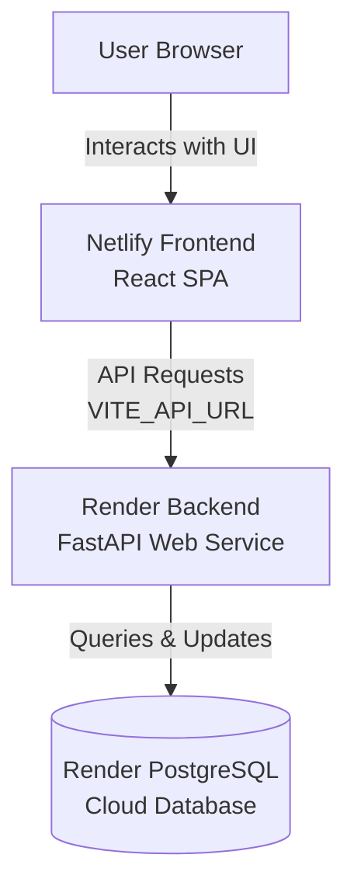

# CrackNest Full-Stack Deployment Guide (Render + Netlify Only)

This guide explains step-by-step how to deploy **CrackNest** using **only Render and Netlify**:
1. **Frontend**: Hosted on **Netlify** (Vite + React SPA)
2. **Backend & Database**: Hosted on **Render** (FastAPI + Python + Render PostgreSQL Database)

---

## Architecture Overview



---

## Step 1: Database Setup (Render PostgreSQL)

You can create a free PostgreSQL database directly inside **Render** without needing any third-party service:

1. Log in to your [Render Dashboard](https://dashboard.render.com/).
2. Click **New +** and select **PostgreSQL**.
3. Fill in the details:
   - **Name**: `cracknest-db`
   - **Database**: `cracknest`
   - **User**: `cracknest_user`
   - **Region**: Select the same region as your backend (e.g., `Oregon (US West)`).
   - **Plan**: **Free**
4. Click **Create Database**.
5. Once created, copy the **Internal Database URL** (if backend is on Render) or **External Database URL**. You will set this as `DATABASE_URL` in your backend environment variables.

---

## Step 2: Backend Deployment (Render)

Render is a popular and free-tier-friendly host for Python/FastAPI backends.

1. Create an account on [Render.com](https://render.com/).
2. Push your `cracknest` code to a repository on **GitHub** (if not already done).
3. In the Render Dashboard, click **New +** and select **Web Service**.
4. Connect your GitHub repository.
5. Configure the Web Service settings:
   - **Name**: `cracknest-backend`
   - **Root Directory**: `backend`
   - **Language**: `Python`
   - **Branch**: `main` (or whichever branch has your production code)
   - **Build Command**: `pip install -r requirements.txt`
   - **Start Command**: `uvicorn main:app --host 0.0.0.0 --port $PORT`
   - **Instance Type**: **Free** (or Starter)

6. Scroll down and click **Advanced** -> **Add Environment Variable**:
   - Add `DATABASE_URL` and paste your PostgreSQL connection string from Step 1.
     > **Note**: If your connection string starts with `postgres://`, our updated code in `database.py` automatically converts it to `postgresql://` for SQLAlchemy compatibility.
   - Add `ALLOWED_ORIGINS` and set it to your frontend URL. If you don't have it yet, you can configure this to your Netlify site URL after Step 3 (e.g. `https://cracknest.netlify.app`).
   - Add any other API keys the backend needs (like OpenAI keys or Gemini keys if they are accessed from the backend).

7. Click **Create Web Service**. Render will start building and deploying your FastAPI backend. Once successfully deployed, copy your backend URL (e.g., `https://cracknest-backend.onrender.com`).

---

## Step 3: Frontend Deployment (Netlify)

Netlify is optimized for fast, global hosting of React/Vite single-page applications.

### 1. Configure Netlify Settings
1. Go to [Netlify.com](https://www.netlify.com/) and sign up / log in.
2. Click **Add new site** -> **Import an existing project** -> **GitHub**.
3. Choose your `cracknest` repository.
4. Configure the Site settings:
   - **Base directory**: `frontend`
   - **Build command**: `npm run build` (This runs `vite build`)
   - **Publish directory**: `frontend/dist` (Vite compiles your static assets into the `dist` folder)

### 2. Set Environment Variables
Before clicking Deploy, click **Environment variables** -> **Add a single variable**:
- **`VITE_API_URL`**: Set this to your backend API route, which must end with `/api`.
  - *Example*: `https://cracknest-backend.onrender.com/api`
- **`VITE_GOOGLE_CLIENT_ID`**: Paste your Google Client ID for OAuth login.
- **`VITE_GEMINI_API_KEY`**: Paste your Gemini API key if used on the frontend.

### 3. Deploy
1. Click **Deploy [Site Name]**.
2. Netlify will build your React application.
3. Once completed, Netlify will generate a site URL for you (e.g., `https://wonderful-cookie-12345.netlify.app`). You can change this to a custom domain or a custom Netlify subdomain (e.g., `https://cracknest.netlify.app`) under **Site configuration** -> **Domain management**.

### 4. Update Backend CORS Allowed Origins
Now that you have your Netlify URL:
1. Go back to your Render Dashboard for your backend.
2. Navigate to **Environment Variables**.
3. Edit the `ALLOWED_ORIGINS` variable and set it to your Netlify URL (e.g. `https://cracknest.netlify.app`).
4. Save the changes. Render will automatically redeploy the backend with the updated CORS permissions.

---

## Troubleshooting & Verification

### 1. React Router 404 on Page Refresh
If you refresh the browser while on a route like `/dashboard` and get a Netlify `404 Not Found` error, ensure that you have the redirect rules set up.
*Your project already includes the correct file: `frontend/public/_redirects` contains:*
```text
/*    /index.html   200
```
This tells Netlify to redirect all routes to the frontend React router index so it can render the page correctly.

### 2. CORS Errors in the Browser Console
If you see errors like `Access-Control-Allow-Origin header is missing` or `CORS preflight failed`:
- Verify that `ALLOWED_ORIGINS` in your backend environment variables exactly matches the URL in the browser address bar (including `https://` but **without** a trailing slash `/`).
- Verify that you did not set `ALLOWED_ORIGINS` to `*` while using credentials (`allow_credentials=True`), as this is rejected by browsers. Our modified backend uses the exact comma-separated URLs you provide.

### 3. Database Connection Issues
If the backend crashes with a database connection error:
- Ensure your Neon/Supabase connection string is correct and has `sslmode=require` appended to the end of the query string.
- If using Render PostgreSQL, ensure you are using the **External Database URL** (not the Internal one, unless the backend and database are hosted in the same Render region).
